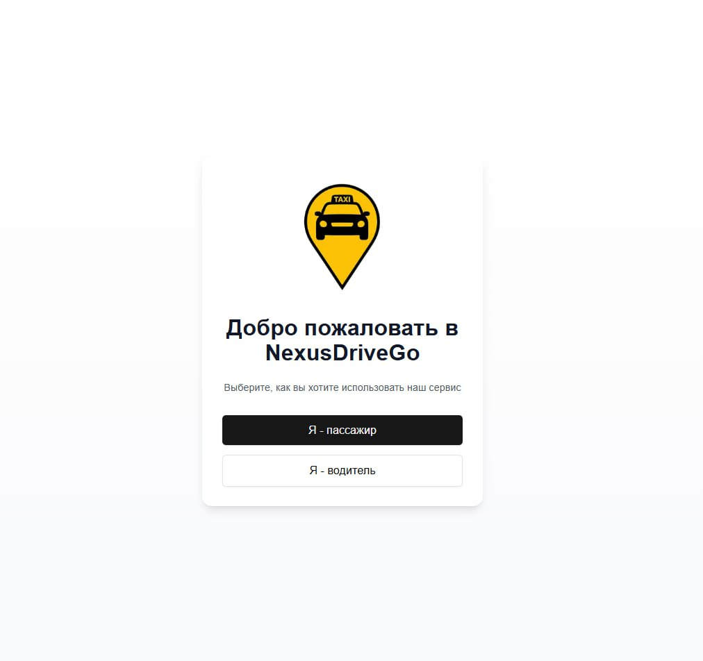
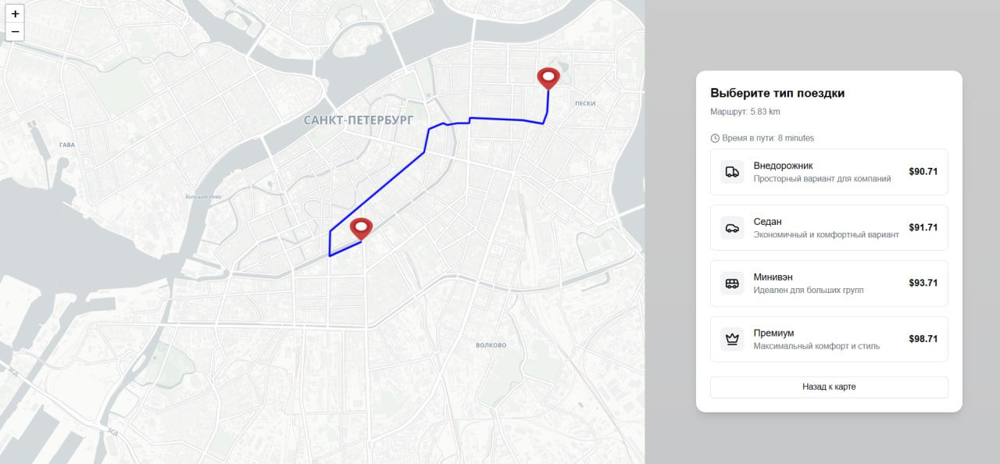
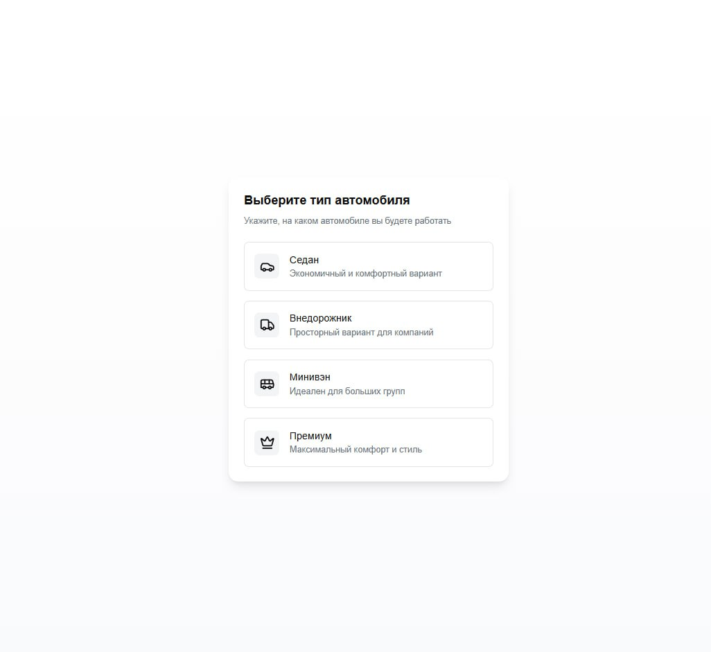
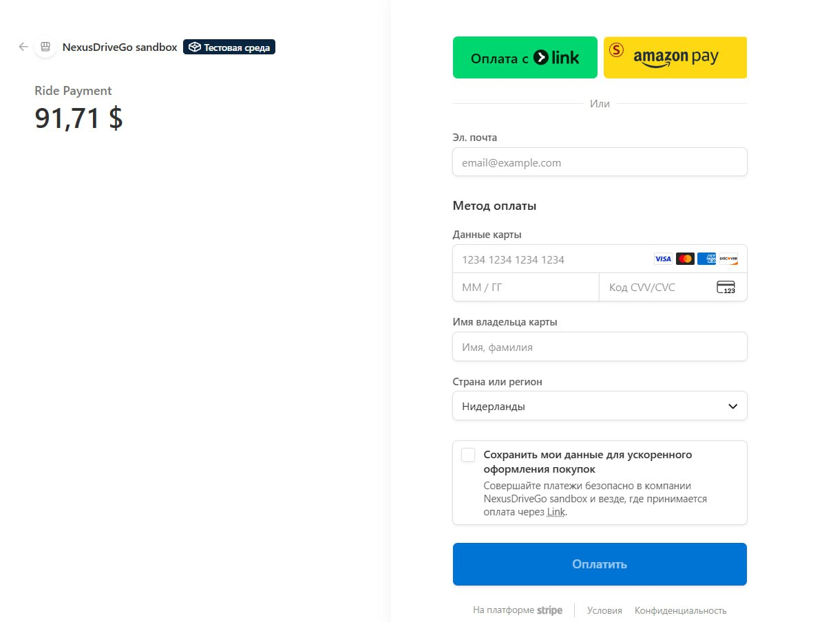
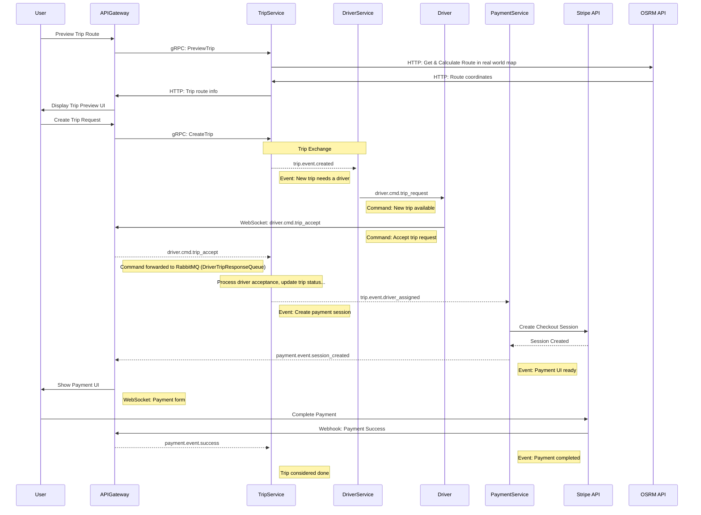

# NEXUS DRIVE GO

Полнофункциональная платформа для заказа и предоставления услуг такси, построенная на микросервисной архитектуре. Система включает бэкенд на Go и современный фронтенд на Next.js v15.

## 🏗️ Обзор архитектуры

Проект использует **микросервисную архитектуру** с событийно-ориентированным взаимодействием:

### Сервисы на Go

- **API Gateway** - HTTP/WebSocket шлюз для клиентов, маршрутизирует запросы
- **Trip Service** - Управление поездками, планирование маршрутов, расчет тарифов
- **Driver Service** - Управление водителями, отслеживание местоположения
- **Payment Service** - Обработка платежей через Stripe

### Фронтенд

- **Web Frontend** - Next.js приложение на React с интерактивной картой (Leaflet)

### Инфраструктура

- **RabbitMQ** - Message broker для асинхронного взаимодействия сервисов
- **MongoDB** - Хранилище данных поездок и тарифов
- **Jaeger** - Распределённое трассирование
- **Kubernetes** - Оркестрация контейнеров (local k8s для разработки)

## 📸 Скриншоты

<div align="center">

### Главная страница



_Выбор роли: пассажир или водитель_

---

### Карта пассажира



_Интерактивная карта с выбором маршрута и отображением доступных водителей_

---

### Выбор типа автомобиля



_Выбор категории автомобиля с расчётом тарифа_

---

### Карта водителя


_Интерфейс водителя с информацией о заказе_

---

### Оплата поездки



_Интеграция со Stripe для безопасной оплаты_

</div>

## 📊 Диаграмма последовательности

Вот последовательностная диаграмма, иллюстрирующая процесс создания поездки и взаимодействия сервисов:



## ✨ Особенности

### Для пассажиров

- 🗺️ Интерактивная карта с выбором маршрута
- 💰 Расчет тарифов в реальном времени для разных типов автомобилей
- 🚗 Выбор категории автомобиля (Седан, Внедорожник, Минивэн, Премиум)
- 👨‍💼 Информация о водителе и отслеживание в реальном времени
- 💳 Интеграция с Stripe для безопасных платежей
- 📍 WebSocket соединение для обновления статуса в реальном времени

### Для водителей

- 📍 Геолокация и регистрация местоположения
- 🎯 Выбор категории автомобиля при подключении
- 📬 Уведомления о новых заказах в реальном времени
- ✅ Принятие/отклонение заказов
- 👤 Отображение профиля водителя на карте пассажира

### Общие

- 🔐 Безопасная обработка платежей (Stripe webhooks)
- 📊 Распределённое трассирование (Jaeger)
- 🔄 Асинхронное взаимодействие через RabbitMQ
- 🚀 Масштабируемая микросервисная архитектура
- 🐳 Docker & Kubernetes для простого развёртывания

## 🚀 Быстрый старт

### Требования

- **Go** 1.24.6+
- **Node.js** 20+
- **Docker & Docker Compose**
- **Kubernetes** (Minikube, Docker Desktop или облако)
- **Tilt** для локальной разработки

### Локальная разработка с Tilt

Самый простой способ запустить всё сразу:

```bash
# Клонируем репозиторий
git clone https://github.com/n-korel/nexus-drive-go.git
cd nexus-drive-go

# Создаём .env файл
cp .env.example .env
# Редактируем конфигурацию (API ключи Stripe, MongoDB URI, etc.)

# Запускаем всё через Tilt
tilt up
```

Tilt автоматически:

- ✅ Собирает все сервисы
- ✅ Деплоит в локальный Kubernetes
- ✅ Включает горячую перезагрузку при изменении кода
- ✅ Открывает дашборд с логами

Приложение доступно по адресу https://nexus-drive-go.vercel.app/

## 📁 Структура проекта

```
nexus-drive-go/
├── services/
│   ├── api-gateway/              # HTTP/WebSocket шлюз
│   │   ├── main.go
│   │   ├── http.go               # HTTP обработчики
│   │   ├── ws.go                 # WebSocket логика
│   │   └── grpc_clients/         # gRPC клиенты к другим сервисам
│   ├── trip-service/             # Управление поездками
│   │   ├── cmd/main.go
│   │   ├── internal/
│   │   │   ├── domain/           # Бизнес логика
│   │   │   ├── service/          # Сервисный слой
│   │   │   ├── infrastructure/   # Интеграции и репозитории
│   │   └── pkg/types/            # Типы данных
│   ├── driver-service/           # Управление водителями
│   └── payment-service/          # Обработка платежей (Stripe)
│
├── web/                          # Next.js фронтенд
│   ├── src/
│   │   ├── app/                  # Next.js страницы и layout
│   │   ├── components/           # React компоненты
│   │   │   ├── DriverMap.tsx     # Карта для водителя
│   │   │   ├── RiderMap.tsx      # Карта для пассажира
│   │   │   └── ui/               # shadcn/ui компоненты
│   │   ├── hooks/                # Custom React hooks
│   │   │   ├── useDriverStreamConnection.ts
│   │   │   └── useRiderStreamConnection.ts
│   │   ├── types.ts              # TypeScript типы
│   │   ├── contracts.ts          # API контракты
│   │   └── utils/                # Утилиты
│   ├── public/                   # Статические файлы
│   └── package.json
│
├── shared/                       # Общий код для Go сервисов
│   ├── contracts/                # Контракты сообщений
│   ├── db/                       # MongoDB утилиты
│   ├── env/                      # Конфигурация окружения
│   ├── messaging/                # RabbitMQ wrapper
│   ├── proto/                    # Protocol Buffer коды
│   ├── retry/                    # Логика переповторов
│   ├── tracing/                  # OpenTelemetry интеграция
│   └── types/                    # Общие типы
│
├── proto/                        # Protocol Buffer определения
│   ├── driver.proto
│   └── trip.proto
│
├── deployment/
│   └── development/
│       ├── docker/               # Dockerfiles
│       └── k8s/                  # Kubernetes манифесты
│
├── Tiltfile                      # Конфигурация Tilt
├── Makefile                      # Build команды
└── go.mod                        # Go модуль
```

## 🔐 Безопасность

- 🔒 Stripe webhook signature verification
- 🔐 gRPC communication между сервисами (без шифрования в dev, добавить mTLS для prod)
- 🛡️ Конфигурация через переменные окружения
- 📋 Graceful shutdown с context cancellation
- 🔄 Retry logic с exponential backoff
- 📪 Dead Letter Queue для неудачных сообщений

## 📦 Зависимости

### Go

- `google.golang.org/grpc` - gRPC фреймворк
- `go.mongodb.org/mongo-driver` - MongoDB драйвер
- `github.com/rabbitmq/amqp091-go` - RabbitMQ клиент
- `github.com/stripe/stripe-go` - Stripe API
- `go.opentelemetry.io/*` - OpenTelemetry трассирование

### Node.js / Frontend

- `next` - React фреймворк
- `react-leaflet` - Интеграция Leaflet с React
- `@stripe/stripe-js` - Stripe интеграция
- `tailwindcss` - CSS фреймворк
- `shadcn/ui` - UI компоненты
- `lucide-react` - Иконки

## 🔌 API и WebSocket

### HTTP REST Endpoints (API Gateway)

#### Поездки

- `POST /trip/preview` - Получить предпросмотр маршрута и тарифы

  ```json
  {
    "userID": "user-123",
    "pickup": { "latitude": 59.92, "longitude": 30.31 },
    "destination": { "latitude": 59.93, "longitude": 30.32 }
  }
  ```

- `POST /trip/start` - Создать и запустить поездку
  ```json
  {
    "rideFareID": "fare-id",
    "userID": "user-123"
  }
  ```

#### Webhooks

- `POST /webhook/stripe` - Stripe webhook для обработки платежей

### WebSocket соединения

#### Водители

```
WS /ws/drivers?userID={userID}&packageSlug={sedan|suv|van|luxury}
```

**События от сервера:**

- `driver.cmd.register` - Подтверждение регистрации
- `driver.cmd.trip_request` - Новый запрос на поездку
- `payment.event.session_created` - Оплата готова

**События от клиента:**

- `driver.cmd.trip_accept` - Принять поездку
- `driver.cmd.trip_decline` - Отклонить поездку
- `driver.cmd.location` - Обновить местоположение

#### Пассажиры

```
WS /ws/riders?userID={userID}
```

**События от сервера:**

- `driver.cmd.location` - Местоположение доступных водителей
- `trip.event.created` - Поездка создана
- `trip.event.driver_assigned` - Водитель назначен
- `trip.event.no_drivers_found` - Водители не найдены
- `payment.event.session_created` - Требуется оплата

## 📡 Событийная система (RabbitMQ)

### События поездок

- `trip.event.created` - Поездка создана, начинается поиск водителей
- `trip.event.driver_assigned` - Водитель назначен пассажиру
- `trip.event.no_drivers_found` - Нет свободных водителей
- `trip.event.driver_not_interested` - Водитель отклонил поездку

### Команды водителей

- `driver.cmd.trip_request` - Запрос отправлен водителю
- `driver.cmd.trip_accept` - Водитель принял поездку
- `driver.cmd.trip_decline` - Водитель отклонил поездку

### События платежей

- `payment.cmd.create_session` - Создать сессию Stripe
- `payment.event.session_created` - Сессия создана
- `payment.event.success` - Платёж успешен
